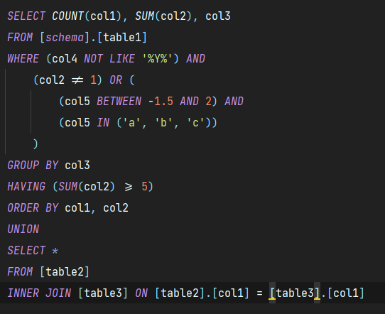

# SQL Fluent Builder

Welcome to the SQL fluent builder. This package aims to provide a straightforward light-weight class to help you write your SQL queries within .NET.
The main goal is to buy you time while writing your SQL strings. 
You will benefit from data conversion to SQL string, formatting, assured correctness on SQL statements and also the fluent way of writing SQL. If you don`t want to put your queries in static files, you are in the right place. 

In this brief Readme we can give you a glimpse of what kind of complexity you might achieve when use the package. Here follows an example of a generic complex query

Once the `ToSql()` method is called, it gives us the `result` string which turns out to be the following SQL
string

Note that the line breaks in this image is merely illustrative. The final result is the same but without line breaks.

Ok, that's one `SELECT` example. What about the other statements? Well, we have support to all of them, even for `SELECT INTO` statements, `ANY`, `ALL`, `EXISTS`, *etc*. 
We cover all possibilities in our [Wiki](https://github.com/Johnvanazzi/sql-fluent-builder/wiki), go check it out.

## Installing the package
To install the package latest version in your project just run the .NET CLI command in you terminal
~~~bash
dotnet add package sql-fluent-builder
~~~

You may also want to install a specific version of the package. In that case you can run
~~~bash
dotnet add package sql-fluent-builder -v <VERSION_NUMBER>
~~~

where `<VERSION_NUMBER>` should be replaced by the version number required, *e.g.* `1.0.1`.

Or you can add it through your preferred IDE tools. Feel free to do whatever suits you better.

## Documentation
In the project's [Wiki](https://github.com/Johnvanazzi/sql-fluent-builder/wiki) we provide a complete documentation on how to use the package, all its features, extension methods and more.

## Contact, Suggestions and Help
If you have any concern, advice or suggestion or even want to collaborate directly in the code, you can reach me out personally through the email jvbvanazzi@gmail.com.

As for bug report, we kindly ask you to open an [Issue](https://github.com/Johnvanazzi/sql-fluent-builder/issues) on GitHub.